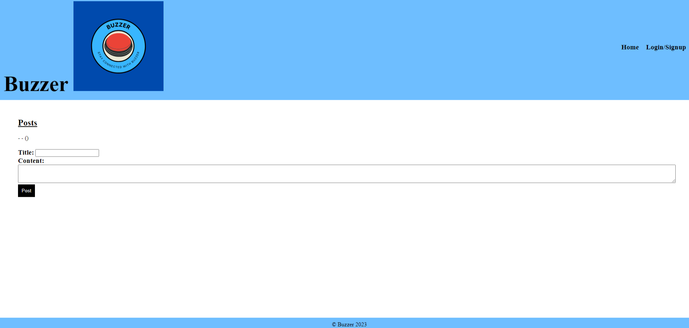

# **Buzzer** 

## Description
Buzzer is a full-stack web app that provides users with a simple and user-friendly platform to create posts as a way to connect with others in the online community.
## Installation
We utilzed Node.js, Express.js, MYSQL, and the validator package.
You can access the webpage through the CLI using npm start or through Heroku.
## Usage
- User can use the app to post and view comments.
- User is first presented with a homepage with a login/signup button at the top of the page. 

- User can signup for a new account or login to an existing account when they click on the login/signup button.
- Once logged in, the user can view the homepage, and create new posts when they click the home button and view their profile when they click on profile. 
- The user can also logout when they click the logout button, and will no longer be able to create new posts.
## Contributors
 
<!-- Made with [contrib.rocks](https://contrib.rocks). -->

- Justen Tatum
- Melanie Islas
- Oscar Campos
- Ana Campos
- Haris Mahjoob

## License
MIT License
Copyright (c) 2023 
## Link to Github repo:
https://github.com/Radioactive-mtb/Buzzer
## Link to deployed project
https://fathomless-wave-31109.herokuapp.com/
